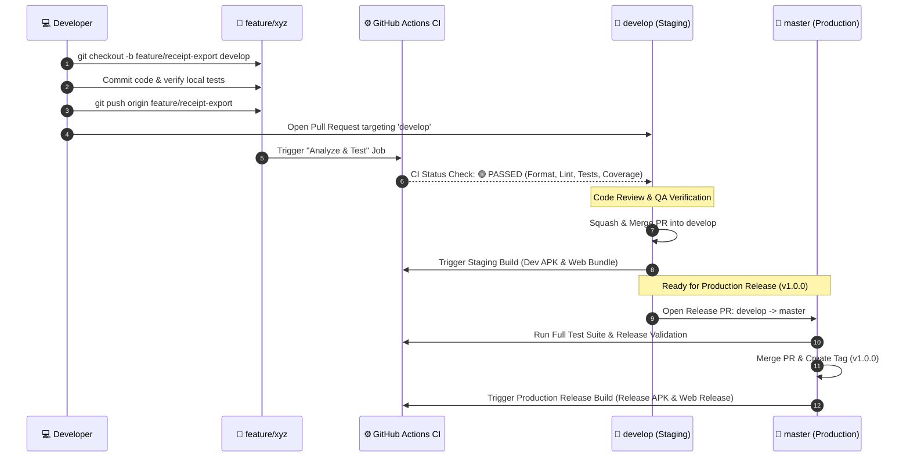

# Receipt Logging — Git Branching Strategy & CI/CD Pipeline Guide

This document defines the **Branching Model**, **Pull Request Protocols**, **Code Quality Gates**, and **GitHub Actions CI/CD Pipeline** for the Receipt Logging mobile & web application.

---

## 🌳 1. Branching Model Architecture (Light GitFlow)

Our repository uses a **Dual-Trunk / Light GitFlow** branching strategy designed for high-velocity multi-developer collaboration while maintaining strict production stability.

```
┌─────────────────────────────────────────────────────────────────────────────┐
│                           BRANCH HIERARCHY OVERVIEW                         │
│                                                                             │
│   [master / main]  ───────────────────●───────────────────────────●───────  │
│   (Production)                        ▲                           ▲ (Hotfix)│
│                                       │ (Release PR)              │         │
│   [develop]        ────●──────────────●──────────────●────────────┴───────  │
│   (Staging Hub)        ▲                             ▲                      │
│                        │ (Feature PR)                │ (Bugfix PR)          │
│   [feature/*]      ────┴──────────────               │                      │
│   (Topic/Task)                                       │                      │
│   [bugfix/*]       ──────────────────────────────────┴────────              │
└─────────────────────────────────────────────────────────────────────────────┘
```

---

## 🏷️ 2. Detailed Branch Roles & Rules

### A. Permanent Long-Lived Branches

| Branch | Purpose & Role | Stability | Protection Rules |
|---|---|---|---|
| **`master` / `main`** | **Production Release Branch**<br>Contains only verified, tested, store-ready code. Represents the current version deployed to production/app stores. Direct commits are strictly forbidden. | 🟢 Highest (Always Deployable) | • Require PR with ≥ 1 approval<br>• Require CI (`Analyze & Test`) to pass<br>• No force pushes<br>• No deletions |
| **`develop`** | **Active Integration & Staging Hub**<br>The primary development branch. All completed feature and bugfix branches merge here. Serves as the base branch for testing staging builds. | 🟡 Staging (Code Complete) | • Require PR with ≥ 1 approval<br>• Require CI (`Analyze & Test`) to pass<br>• No force pushes |

---

### B. Ephemeral Working Branches

| Branch Type | Base Branch | Merge Target | Naming Convention & Examples | Lifecycle |
|---|---|---|---|---|
| **`feature/*`** | `develop` | `develop` | `feature/<ticket-or-description>`<br>• `feature/theme-persistence`<br>• `feature/ocr-batch-processing`<br>• `feature/settings-export` | Deleted immediately after PR squash-merge |
| **`bugfix/*`** | `develop` | `develop` | `bugfix/<issue-description>`<br>• `bugfix/currency-conversion-overflow`<br>• `bugfix/camera-preview-aspect-ratio` | Deleted immediately after PR merge |
| **`hotfix/*`** | `master` | `master` **AND** `develop` | `hotfix/<critical-issue>`<br>• `hotfix/supabase-auth-token-crash`<br>• `hotfix/isar-db-migration-lock` | Deleted after dual-merge to `master` and `develop` |
| **`release/*`** *(optional)* | `develop` | `master` **AND** `develop` | `release/vX.Y.Z`<br>• `release/v1.0.0`<br>• `release/v1.1.0` | Created for final QA freeze; merged with version tag |

---

## 🔄 3. Pull Request & CI/CD Lifecycle



---

## ⚙️ 4. GitHub Actions CI/CD Pipeline Breakdown

The automated pipeline is defined in [`.github/workflows/ci.yml`](file:///.github/workflows/ci.yml).

### Workflow Jobs & Triggers

| Job Name | Trigger Events | Steps Executed | Artifacts Generated |
|---|---|---|---|
| **`analyze-and-test`** | • Pull Request to `master`, `main`, `develop`<br>• Push to `master`, `main`, `develop`<br>• Manual `workflow_dispatch` | 1. Set up Java 17 & Flutter SDK (stable)<br>2. Generate CI `.env`<br>3. `flutter pub get`<br>4. `dart format --output=none --set-exit-if-changed lib test`<br>5. `flutter analyze`<br>6. `flutter test --coverage` | `coverage-report` (`lcov.info`) |
| **`build-android`** | • Push to `master`, `main`, `develop`<br>• Manual `workflow_dispatch`<br>*(Requires `analyze-and-test` to pass)* | 1. Set up Java 17 & Flutter SDK<br>2. Inject environment secrets<br>3. `flutter build apk --release` | `android-release-apk` (`app-release.apk`) |
| **`build-web`** | • Push to `master`, `main`, `develop`<br>• Manual `workflow_dispatch`<br>*(Requires `analyze-and-test` to pass)* | 1. Set up Flutter SDK<br>2. Inject environment secrets<br>3. `flutter build web --release` | `web-release-bundle` (`build/web`) |

---

## 5. GitHub Repository Branch Protection Setup

To enforce this workflow, configure these branch protection rules in GitHub (**Settings → Branches → Add rule**):

### Rule for `master` / `main`
- **Branch name pattern**: `master` (or `main`)
- Require a pull request before merging (minimum 1 approving review)
- Require status checks to pass before merging:
  - `Analyze and Test`
- Require branches to be up to date before merging
- Allow force pushes: Disabled
- Allow deletions: Disabled

### Rule for `develop`
- **Branch name pattern**: `develop`
- Require a pull request before merging (minimum 1 approving review)
- Require status checks to pass before merging:
  - `Analyze and Test`
- Allow force pushes: Disabled

---

## 💻 6. Daily Developer Cheatsheet

### Starting a New Feature
```bash
# 1. Ensure you have the latest integration branch
git checkout develop
git pull origin develop

# 2. Create your isolated feature branch
git checkout -b feature/my-feature-name

# 3. Work, test, and commit locally
git add .
git commit -m "feat(settings): add theme persistence and customisation options"
```

### Keeping Your Feature Branch Updated
```bash
# Fetch latest remote changes and rebase on top of develop
git fetch origin
git rebase origin/develop
```

### Submitting Work via Pull Request
```bash
# Push your feature branch to remote
git push -u origin feature/my-feature-name

# -> Go to GitHub and open a PR targeting 'develop'
```

### Hotfix Workflow (Emergency Production Fix)
```bash
# 1. Branch from production
git checkout master
git pull origin master
git checkout -b hotfix/critical-fix

# 2. Fix, test, and commit
git commit -m "fix(auth): resolve token refresh crash on app resume"
git push -u origin hotfix/critical-fix

# 3. Open PR to 'master' AND backport to 'develop'
```
