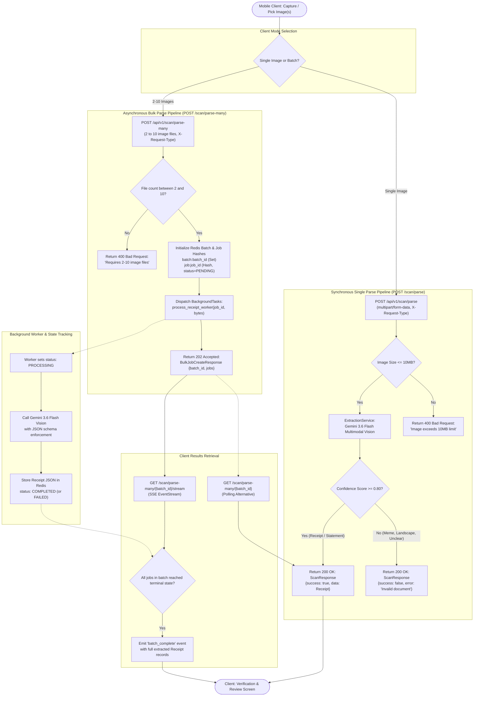

# Receipt Logger Backend — API Specification

This document provides the complete API specification for the **Receipt Logger FastAPI Backend (v1)**, including HTTP methods, authentication contracts, request parameters, response schemas, and an architectural flowchart for the receipt parsing pipeline.

---

## 1. Base URL & Authentication Architecture

- **Base URL**: `/api/v1`
- **Protocol**: HTTP/1.1 and HTTP/2 over TLS
- **Data Formats**: `application/json`, `multipart/form-data`, `text/event-stream`

### Header Requirements & Auth Matrix

The backend enforces session-scoped, JWT-authenticated, and device-fingerprinted access across all routes:

| Category | Endpoints | Required Headers | Description |
| :--- | :--- | :--- | :--- |
| **Public** | `/health/`, `POST /user/create`, `POST /user/login`, `POST /user/refresh`, `POST /user/reset-password-*`, `POST /devices/register` | *None* | Unauthenticated endpoints with rate limiting against brute-force attacks. |
| **Device / Guest** | `GET /devices/me`, `DELETE /devices/me`, `POST /devices/rotate-token` | `X-Device-Name`, `X-Device-Token` | Cryptographic hardware fingerprint verification. `X-Device-Token` is verified against stored SHA-256 hash using constant-time comparison. |
| **User Scoped** | `GET /user/me`, `PATCH /user/me`, `DELETE /user/me`, `/receipts/*`, `/chat/list`, `/chat/history`, `/chat/create`, `DELETE /chat/*` | `Authorization: Bearer <access_token>` *(Recommended)*<br>**OR** `X-User-Name`, `X-User-Token` *(Legacy)* | Standard signed JWT access token (fast 0-query check) or legacy password token credentials. |
| **Link Bridge** | `POST /devices/link` | `X-Device-Name`, `X-Device-Token`, plus `Authorization: Bearer <access_token>` (or `X-User-Name` + `X-User-Token`) | Linking binds device to account; unlinking (guest mode) requires only device headers. |
| **Dual-Scoped** | `POST /scan/parse`, `POST /scan/parse-many`, `POST /chat/query` | `X-Request-Type` + Mode Credentials | Set `X-Request-Type: guest` with device headers OR `X-Request-Type: user` with `Authorization: Bearer <access_token>`. |
| **SSE Streaming** | `GET /scan/parse-many/{batch_id}/stream` | Header or Query Params | **Guest**: `X-Device-Name` + `X-Device-Token` or `?device_name=...&device_token=...`<br>**User**: `Authorization: Bearer <token>` or `?token=<access_token>`. |

---

## 2. Receipt Parsing Architecture & Flowchart

The parsing pipeline supports both **Synchronous Single Receipt Extraction** (`POST /scan/parse`) and **Asynchronous Bulk Processing with Real-Time SSE Streaming** (`POST /scan/parse-many`).

### End-to-End Parsing Flowchart



---

## 3. Endpoints Catalog

### 3.1 Scanning (`/api/v1/scan`)

#### `POST /api/v1/scan/parse`
Submit a single receipt image for synchronous AI extraction.

- **Method**: `POST`
- **Content-Type**: `multipart/form-data`
- **Headers**:
  - `X-Request-Type`: `"guest"` or `"user"`
  - `X-Device-Name` & `X-Device-Token` (if `guest`)
  - `X-User-Name` & `X-User-Token` (if `user`)
- **Body**: `image` (binary file, max 10MB)
- **Response `200 OK`**:
  ```json
  {
    "success": true,
    "data": {
      "merchant_name": "Whole Foods Market",
      "line_items": [
        {
          "description": "Organic Almond Milk",
          "quantity": 2.0,
          "unit_price": 3.99,
          "total_price": 7.98
        }
      ],
      "subtotal": 7.98,
      "tax_amount": 0.64,
      "total_amount": 8.62,
      "currency": "USD",
      "category": "Groceries",
      "date": "2026-08-19T14:30:00Z",
      "raw_text": "WHOLE FOODS MARKET...",
      "confidence_score": 0.96,
      "notes": null
    },
    "error": null
  }
  ```

#### `POST /api/v1/scan/parse-many`
Submit 2 to 10 receipt images for async background parsing.

- **Method**: `POST`
- **Content-Type**: `multipart/form-data`
- **Headers**: `X-Request-Type` + mode credentials
- **Body**: `files` (array of 2 to 10 binary files)
- **Response `202 Accepted`**:
  ```json
  {
    "batch_id": "9f3a4b12-8c11-4f1a-b67e-123456789abc",
    "total_jobs": 2,
    "jobs": [
      { "job_id": "a1b2c3d4-...", "filename": "receipt_1.jpg" },
      { "job_id": "e5f6a7b8-...", "filename": "receipt_2.jpg" }
    ]
  }
  ```

#### `GET /api/v1/scan/parse-many/{batch_id}`
Query batch status and retrieve all extracted receipts.

- **Method**: `GET`
- **Path Parameter**: `batch_id` (UUID)
- **Response `200 OK`**:
  ```json
  {
    "batch_id": "9f3a4b12-8c11-4f1a-b67e-123456789abc",
    "total_jobs": 2,
    "completed_jobs": 2,
    "jobs": [
      {
        "job_id": "a1b2c3d4-...",
        "batch_id": "9f3a4b12-...",
        "filename": "receipt_1.jpg",
        "status": "COMPLETED",
        "data": { "merchant_name": "Target", "total_amount": 45.20 },
        "error": null
      }
    ]
  }
  ```

#### `GET /api/v1/scan/parse-many/{batch_id}/stream`
Open an SSE connection that streams progress and emits the full result payload upon batch completion.

- **Method**: `GET`
- **Response Content-Type**: `text/event-stream`
- **Events Emitted**:
  - `: keep-alive` (comment heartbeat every 1s)
  - `event: batch_complete` with full `BulkBatchStatusResponse` JSON payload
  - `event: timeout` on 120s poll timeout
  - `event: error` on invalid batch ID or service disruption

---

### 3.2 Receipts (`/api/v1/receipts`)

#### `GET /api/v1/receipts/`
List receipts for authenticated user with delta sync and pagination.

- **Headers**: `Authorization: Bearer <access_token>` *(Recommended)* or `X-User-Name`, `X-User-Token` *(Legacy)*
- **Query Parameters**:
  - `updated_after` (optional ISO 8601 string): fetch only receipts modified after timestamp
  - `limit` (optional int): number of records
  - `offset` (optional int): pagination offset
- **Response `200 OK`**: `Array<ReceiptRecord>`

#### `GET /api/v1/receipts/{receipt_id}`
Retrieve a specific receipt record by UUID.

- **Headers**: `Authorization: Bearer <access_token>` *(Recommended)* or `X-User-Name`, `X-User-Token` *(Legacy)*
- **Response `200 OK`**: `ReceiptRecord`

#### `POST /api/v1/receipts/create`
Create a new receipt record bound to user identity. Supports optional receipt image upload via multipart/form-data.

- **Headers**: `Authorization: Bearer <access_token>` *(Recommended)* or `X-User-Name`, `X-User-Token` *(Legacy)*
- **Body**: `{"receipt": { ...ReceiptSchema... }}`
- **Response `201 Created`**: `ReceiptRecord`

#### `POST /api/v1/receipts/create/batch`
Batch insert up to 100 receipt records in a single database transaction.

- **Headers**: `Authorization: Bearer <access_token>` *(Recommended)* or `X-User-Name`, `X-User-Token` *(Legacy)*
- **Body**: `{"receipts": [ { ...ReceiptSchema... }, ... ]}`
- **Response `201 Created`**: `Array<ReceiptRecord>`

#### `DELETE /api/v1/receipts/{receipt_id}`
Soft-delete a receipt record (sets `deleted_at` timestamp).

- **Headers**: `Authorization: Bearer <access_token>` *(Recommended)* or `X-User-Name`, `X-User-Token` *(Legacy)*
- **Response `200 OK`**: `{"success": true, "receipt_id": "..."}`

---

### 3.3 Users (`/api/v1/user`)

#### `POST /api/v1/user/create`
Register a new user account.

- **Body**:
  ```json
  {
    "username": "johndoe",
    "email": "johndoe@example.com",
    "password": "plain_password_string",
    "country_code": "+60",
    "mobile_number": "123456789",
    "avatar_image_path": null
  }
  ```
- **Response `201 Created`**: `UserRecord`

#### `POST /api/v1/user/login`
Authenticate user credentials (username or email). Returns signed JWT tokens and profile.

- **Body**: `{"username": "johndoe", "password": "plain_password_string"}`
- **Response `200 OK`**:
  ```json
  {
    "access_token": "eyJhbGciOiJIUzI1NiIsIn...",
    "refresh_token": "eyJhbGciOiJIUzI1NiIsIn...",
    "token_type": "bearer",
    "user": {
      "id": "uuid-...",
      "username": "johndoe",
      "email": "johndoe@example.com",
      "country_code": "+60",
      "mobile_number": "123456789",
      "created_at": "2026-08-19T10:00:00Z"
    }
  }
  ```

#### `POST /api/v1/user/refresh`
Refresh expired JWT access token.

- **Body**: `{"refresh_token": "eyJhbGciOiJIUzI1NiIsIn..."}`
- **Response `200 OK`**: `{"access_token": "...", "token_type": "bearer"}`

#### `GET /api/v1/user/me`
Retrieve profile of authenticated user.

- **Headers**: `Authorization: Bearer <access_token>` *(Recommended)* or `X-User-Name`, `X-User-Token` *(Legacy)*
- **Response `200 OK`**: `UserRecord`

#### `PATCH /api/v1/user/me`
Update mutable profile fields (email, country code, mobile number, avatar, custom categories, preferences).

- **Headers**: `Authorization: Bearer <access_token>` *(Recommended)* or `X-User-Name`, `X-User-Token` *(Legacy)*
- **Body**: `UserUpdateRequest` (partial fields)
- **Response `200 OK`**: `UserRecord`

#### `DELETE /api/v1/user/me`
Soft-delete user profile and invalidate active device sessions.

- **Headers**: `Authorization: Bearer <access_token>` *(Recommended)* or `X-User-Name`, `X-User-Token` *(Legacy)*
- **Response `200 OK`**: `{"success": true, "message": "User profile soft-deleted successfully."}`

#### `POST /api/v1/user/reset-password-initiate`
Initiate password reset via email or mobile. In development, logs 6-digit OTP to console.

- **Body**: `{"identifier": "johndoe@example.com"}`
- **Response `200 OK`**: `{"success": true, "message": "...", "dev_otp": "123456"}`

#### `POST /api/v1/user/reset-password-otp`
Verify 6-digit OTP code and obtain single-use `reset_token`.

- **Body**: `{"identifier": "johndoe@example.com", "otp": "123456"}`
- **Response `200 OK`**: `{"success": true, "reset_token": "token_uuid_...", "message": "OTP verified."}`

#### `POST /api/v1/user/password-reset-new`
Set new password using verified `reset_token`.

- **Body**: `{"reset_token": "token_uuid_...", "new_password": "new_secret_password"}`
- **Response `200 OK`**: `{"success": true, "message": "Password reset completed successfully."}`

---

### 3.4 Devices (`/api/v1/devices`)

#### `POST /api/v1/devices/register`
Register new hardware device or refresh fingerprint token.

- **Body**:
  ```json
  {
    "device_name": "MS701-A1B2C3",
    "device_token": "token_uuid_generated_on_boot",
    "username": null
  }
  ```
- **Response `201 Created`**: `DeviceRecord`

#### `GET /api/v1/devices/me`
Retrieve device registration details.

- **Headers**: `X-Device-Name`, `X-Device-Token`
- **Response `200 OK`**: `DeviceRecord`

#### `POST /api/v1/devices/link`
Link device to a user account with optional guest data migration.

- **Headers**: `X-Device-Name`, `X-Device-Token`, `X-User-Name`, `X-User-Token`
- **Body**:
  ```json
  {
    "device_name": "MS701-A1B2C3",
    "username": "johndoe",
    "migrate_data": {
      "receipts": [ ... ],
      "conversations": [ ... ],
      "chat_messages": [ ... ]
    }
  }
  ```
- **Response `200 OK`**: `DeviceRecord`

#### `POST /api/v1/devices/rotate-token`
Rotate device security token.

- **Headers**: `X-Device-Name`, `X-Device-Token` (current token)
- **Body**: `{"new_device_token": "new_secret_token_uuid"}`
- **Response `200 OK`**: `DeviceRecord`

#### `DELETE /api/v1/devices/me`
Soft-delete device record.

- **Headers**: `X-Device-Name`, `X-Device-Token`
- **Response `200 OK`**: `{"success": true, "device_name": "MS701-A1B2C3"}`

---

### 3.5 AI Financial Chat (`/api/v1/chat`)

#### `POST /api/v1/chat/create`
Create new cloud-persisted chat conversation (max 10 active per user).

- **Headers**: `Authorization: Bearer <access_token>` *(Recommended)* or `X-User-Name`, `X-User-Token` *(Legacy)*
- **Body**: `{"title": "August Spending Review"}` (optional)
- **Response `201 Created`**: `ConversationRecord`

#### `GET /api/v1/chat/list`
List conversations owned by authenticated user.

- **Headers**: `Authorization: Bearer <access_token>` *(Recommended)* or `X-User-Name`, `X-User-Token` *(Legacy)*
- **Query Parameters**: `limit` (default: 20), `offset` (default: 0)
- **Response `200 OK`**: `Array<ConversationRecord>`

#### `GET /api/v1/chat/history`
Fetch paginated message history for a conversation.

- **Headers**: `Authorization: Bearer <access_token>` *(Recommended)* or `X-User-Name`, `X-User-Token` *(Legacy)*
- **Query Parameters**: `conversation_id` (required UUID), `limit`, `offset`
- **Response `200 OK`**: `ChatHistoryResponse`

#### `POST /api/v1/chat/query`
Send query to Gemini 3.6 Flash with Multi-Store Support.

- **Headers**: `X-Request-Type` + mode credentials (`Authorization: Bearer <access_token>` for user mode, or `X-Device-Name` + `X-Device-Token` for guest mode)
- **Body**:
  ```json
  {
    "conversation_id": "uuid-or-null",
    "message": "How much have I spent on groceries this month?",
    "conversation_history": [
      { "role": "user", "content": "Hi" },
      { "role": "assistant", "content": "Hello! How can I help you?" }
    ],
    "recent_receipts": [
      {
        "merchant_name": "Target",
        "total_amount": 54.20,
        "category": "Groceries",
        "date": "2026-08-15"
      }
    ]
  }
  ```
- **Storage Modes**:
  1. **Cloud Store Mode** (`conversation_id` provided): Verified user mode. Reads prior context from Supabase, calls Gemini, saves user + assistant messages to Supabase DB.
  2. **Local Store Mode** (`conversation_id` is null): Guest or local user. Uses client-provided `conversation_history` (max 20) and `recent_receipts` (max 50) for RAG context. Zero Supabase DB persistence. Returns synthetic UUIDs for client Isar DB caching.
- **Response `200 OK`**: `ChatQueryResponse`

#### `DELETE /api/v1/chat/{conversation_id}`
Soft-delete a conversation.

- **Headers**: `Authorization: Bearer <access_token>` *(Recommended)* or `X-User-Name`, `X-User-Token` *(Legacy)*
- **Response `200 OK`**: `{"success": true, "conversation_id": "..."}`

---

### 3.6 Health & System (`/api/v1/health`)

#### `GET /api/v1/health/`
Check backend server status.

- **Response `200 OK`**:
  ```json
  {
    "status": "healthy",
    "environment": "development",
    "version": "1.0.0"
  }
  ```

---

## 4. Error Responses

| Status Code | Reason | Example Response |
| :--- | :--- | :--- |
| `400 Bad Request` | Missing headers, invalid payload, invalid batch count | `{"detail": "Bulk receipt parsing requires between 2 and 10 image files."}` |
| `401 Unauthorized` | Invalid device token or user password | `{"detail": "Invalid user authentication token."}` |
| `403 Forbidden` | Target resource belongs to another device or user | `{"detail": "Cannot modify link status for another device_name."}` |
| `404 Not Found` | Resource ID not found or already deleted | `{"detail": "Receipt not found or already deleted"}` |
| `409 Conflict` | Username or email already registered | `{"detail": "An account with this email already exists."}` |
| `422 Unprocessable Entity` | Schema validation error caught by custom handler | `{"detail": "Request payload schema validation failed.", "errors": [...]}` |
| `429 Too Many Requests` | Rate limit exceeded | `{"detail": "Too many requests. Please retry after 15 seconds."}` |
| `503 Service Unavailable` | Redis or database service temporarily unreachable | `{"detail": "Redis service unavailable. Please check Redis connection."}` |

---

## 5. Local Server Execution

### Windows (PowerShell)
```powershell
.\run.ps1
```

### Linux / macOS
```bash
./run.sh
```

### Interactive Documentation
- Swagger UI: `http://localhost:8085/docs`
- ReDoc: `http://localhost:8085/redoc`
- OpenAPI JSON: `http://localhost:8085/openapi.json`

