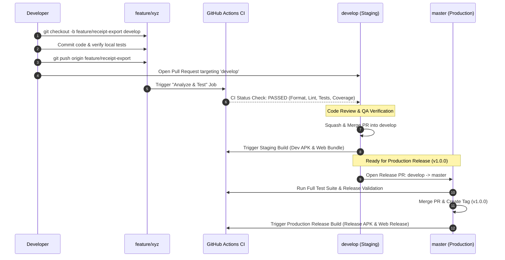

# Receipt Logging — Git Branching Strategy and CI/CD Pipeline Guide

This document defines the Branching Model, Pull Request Protocols, Code Quality Gates, and GitHub Actions CI/CD Pipeline for the Receipt Logging mobile and web application.

---

## 1. Branching Model Architecture (Light GitFlow)

Our repository uses a Dual-Trunk / Light GitFlow branching strategy designed for high-velocity multi-developer collaboration while maintaining production stability.

```
+-----------------------------------------------------------------------------+
|              BRANCH HIERARCHY OVERVIEW             |
|                                       |
|  [master / main] -------------------*---------------------------*------- |
|  (Production)            ^              ^ (Hotfix)|
|                    | (Release PR)       |     |
|  [develop]    ----*--------------*--------------*------------+------- |
|  (Staging Hub)    ^               ^           |
|            | (Feature PR)        | (Bugfix PR)     |
|  [feature/*]   ----+--------------        |           |
|  (Topic/Task)                    |           |
|  [bugfix/*]    ----------------------------------+           |
+-----------------------------------------------------------------------------+
```

---

## 2. Detailed Branch Roles and Rules

### Permanent Long-Lived Branches

| Branch | Purpose and Role | Stability | Protection Rules |
|---|---|---|---|
| **`master` / `main`** | **Production Release Branch**<br>Contains only verified, tested, store-ready code. Represents the current version deployed to production/app stores. Direct commits are strictly forbidden. | Highest (Always Deployable) | • Require PR with at least 1 approval<br>• Require CI (`Analyze & Test`) to pass<br>• No force pushes<br>• No deletions |
| **`develop`** | **Active Integration & Staging Hub**<br>The primary development branch. All completed feature and bugfix branches merge here. Serves as the base branch for testing staging builds. | Staging (Code Complete) | • Require PR with at least 1 approval<br>• Require CI (`Analyze & Test`) to pass<br>• No force pushes |

---

### Ephemeral Working Branches

| Branch Type | Base Branch | Merge Target | Naming Convention & Examples | Lifecycle |
|---|---|---|---|---|
| **`feature/*`** | `develop` | `develop` | `feature/<description>`<br>• `feature/theme-persistence`<br>• `feature/ocr-batch-processing`<br>• `feature/settings-export` | Deleted immediately after PR squash-merge |
| **`bugfix/*`** | `develop` | `develop` | `bugfix/<description>`<br>• `bugfix/currency-conversion-overflow`<br>• `bugfix/camera-preview-aspect-ratio` | Deleted immediately after PR merge |
| **`hotfix/*`** | `master` | `master` and `develop` | `hotfix/<description>`<br>• `hotfix/supabase-auth-token-crash`<br>• `hotfix/isar-db-migration-lock` | Deleted after dual-merge to `master` and `develop` |
| **`release/*`** *(optional)* | `develop` | `master` and `develop` | `release/vX.Y.Z`<br>• `release/v1.0.0`<br>• `release/v1.1.0` | Created for final QA freeze; merged with version tag |

---

## 3. Pull Request and CI/CD Lifecycle



---

## 4. GitHub Actions CI/CD Pipeline Breakdown

The automated pipeline is defined in [`.github/workflows/ci.yml`](file:///.github/workflows/ci.yml).

### Workflow Jobs and Triggers

| Job Name | Trigger Events | Steps Executed | Artifacts Generated |
|---|---|---|---|
| **`analyze-and-test`** | • Pull Request to `master`, `main`, `develop`<br>• Push to `master`, `main`, `develop`<br>• Manual `workflow_dispatch` | 1. Set up Java 17 and Flutter SDK (stable)<br>2. Generate CI `.env`<br>3. `flutter pub get`<br>4. `dart format --output=none --set-exit-if-changed lib test`<br>5. `flutter analyze`<br>6. `flutter test --coverage` | `coverage-report` (`lcov.info`) |
| **`build-android`** | • Push on Release Tag (`v*.*.*`)<br>• Manual `workflow_dispatch`<br>*(Requires `analyze-and-test` to pass)* | 1. Set up Java 17 and Flutter SDK<br>2. Inject environment secrets<br>3. `flutter build apk --release --no-tree-shake-icons` | `android-release-apk` (`app-release.apk`) |
| **`build-ios`** | • Push on Release Tag (`v*.*.*`)<br>• Manual `workflow_dispatch`<br>*(Requires `analyze-and-test` to pass)* | 1. Set up macOS runner & Flutter SDK<br>2. Inject environment secrets<br>3. `flutter build ios --release --no-codesign --no-tree-shake-icons` | `ios-release-app` (`Runner.app`) |
| **`build-web`** | • Push on Release Tag (`v*.*.*`)<br>• Manual `workflow_dispatch`<br>*(Requires `analyze-and-test` to pass)* | 1. Set up Flutter SDK<br>2. Inject environment secrets<br>3. `flutter build web --release` | `web-release-bundle` (`build/web`) |

---

## 5. Local Verification Commands

Before opening a pull request, run the following validation suite locally:

```bash
# 1. Format verification
dart format --output=none --set-exit-if-changed lib test

# 2. Static analysis
flutter analyze

# 3. Unit and widget test execution
flutter test --coverage
```
