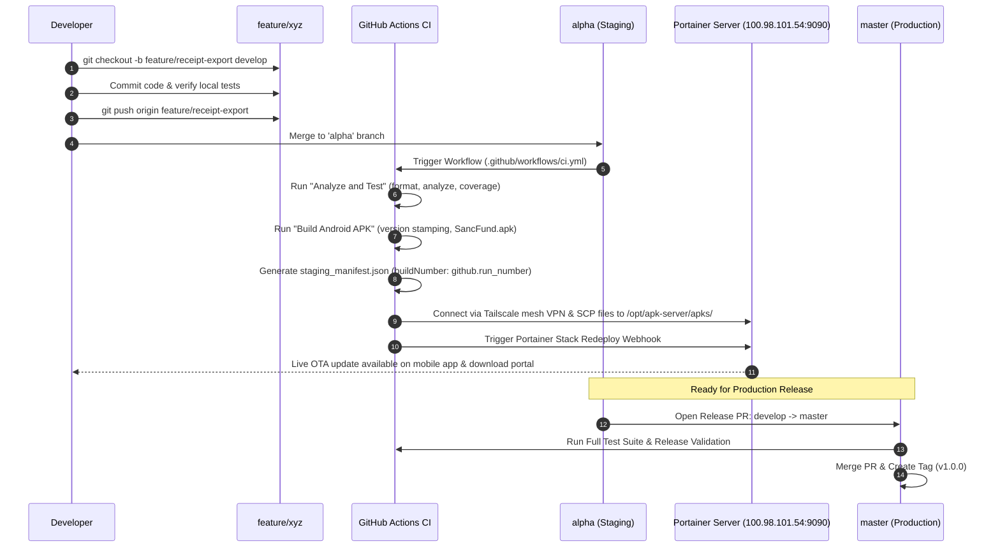

# Receipt Logging — Git Branching Strategy and CI/CD Pipeline Guide

This document defines the Branching Model, Pull Request Protocols, Code Quality Gates, and GitHub Actions CI/CD Pipeline for the Receipt Logging mobile and web application.

---

## 1. Branching Model Architecture (Light GitFlow with Continuous Staging)

Our repository uses a multi-trunk branching strategy tailored for continuous integration and automated homelab staging delivery:

```
+-------------------------------------------------------------------------------------------------+
|                                 BRANCH HIERARCHY OVERVIEW                                       |
|                                                                                                 |
|  [master / main] ----------------------------*---------------------------------------*-------- |
|  (Production)                                ^                                       ^ (Hotfix) |
|                                              | (Release PR)                          |          |
|  [develop]       -------------*--------------*-----------------------*---------------+--------- |
|  (Integration)                ^                                      ^                          |
|                               | (Feature PR)                         | (Bugfix PR)              |
|  [alpha]         -------------*--------------------------------------*------------------------- |
|  (Staging / OTA)              | (Auto Deploy via Tailscale to Portainer APK Server)             |
|                               |                                                                 |
|  [feature/*]     -------------+                                                                 |
|  (Topic/Task)                                                                                   |
|  [bugfix/*]      ----------------------------------------------------+                          |
+-------------------------------------------------------------------------------------------------+
```

---

## 2. Detailed Branch Roles and Rules

### Permanent Long-Lived Branches

| Branch | Purpose and Role | Stability | CI/CD Action & Protection Rules |
|---|---|---|---|
| **`master` / `main`** | **Production Release Branch**<br>Contains only verified, store-ready code. Direct commits are strictly forbidden. | Highest (Always Deployable) | • Require PR with at least 1 approval<br>• Require CI (`Analyze & Test`) to pass<br>• No force pushes |
| **`develop`** | **Active Integration Hub**<br>The primary collaborative development branch. Feature and bugfix branches merge here. | Integration (Code Complete) | • Require PR with at least 1 approval<br>• Require CI (`Analyze & Test`) to pass<br>• No force pushes |
| **`alpha`** | **Continuous Staging & Homelab OTA Distribution**<br>Pushes to `alpha` trigger automated APK compilation, build number stamping, and SCP deployment over Tailscale mesh VPN to Portainer APK distribution server. | Staging / QA Active | • Automatically builds `SancFund.apk`<br>• Generates `staging_manifest.json`<br>• Triggers Portainer webhook redeploy |

---

### Ephemeral Working Branches

| Branch Type | Base Branch | Merge Target | Naming Convention & Examples | Lifecycle |
|---|---|---|---|---|
| **`feature/*`** | `develop` | `develop` | `feature/<description>`<br>• `feature/theme-customization`<br>• `feature/ocr-batch-processing`<br>• `feature/database-export` | Deleted immediately after PR squash-merge |
| **`bugfix/*`** | `develop` | `develop` | `bugfix/<description>`<br>• `bugfix/text-scale-overflow`<br>• `bugfix/camera-preview-aspect-ratio` | Deleted immediately after PR merge |
| **`hotfix/*`** | `master` | `master` and `develop` | `hotfix/<description>`<br>• `hotfix/supabase-auth-token-crash`<br>• `hotfix/isar-db-migration-lock` | Deleted after dual-merge to `master` and `develop` |

---

## 3. Pull Request and CI/CD Lifecycle



---

## 4. GitHub Actions CI/CD Pipeline Breakdown

The automated pipeline is defined in [`.github/workflows/ci.yml`](file:///.github/workflows/ci.yml).

### Workflow Jobs and Triggers

| Job Name | Trigger Events | Steps Executed | Artifacts Generated |
|---|---|---|---|
| **`analyze-and-test`** | • Pull Request to `master`, `develop`, `alpha`<br>• Push to `master`, `develop`, `alpha`<br>• Manual `workflow_dispatch` | 1. Set up Java 17 and Flutter SDK (stable)<br>2. Generate CI `.env`<br>3. `flutter pub get`<br>4. `dart format --output=none --set-exit-if-changed lib test`<br>5. `flutter analyze`<br>6. `flutter test --coverage` | `coverage-report` (`lcov.info`) |
| **`build-android`** | • Push to `alpha`, `develop`, `master`<br>• Release Tag (`v*.*.*`)<br>• Manual `workflow_dispatch` | 1. Set up Java 17 & Flutter SDK<br>2. Stamped `--build-name`, `--build-number`, and `--dart-define` metadata<br>3. Compile `build/app/outputs/flutter-apk/SancFund.apk`<br>4. Generate `staging_manifest.json` | `android-release-apk` (`SancFund.apk`)<br>`staging-manifest` (`staging_manifest.json`) |
| **`deploy-to-tailscale-server`** | • Push to `alpha`<br>• Manual `workflow_dispatch` | 1. Connect runner to Tailscale mesh VPN (`tailscale/github-action@v3`)<br>2. SCP `SancFund.apk`, `staging_manifest.json`, and `index.html` to staging server<br>3. Trigger Portainer stack redeploy webhook | Deployed to `http://100.98.101.54:9090/` |

---

## 5. Staging & OTA Updates Guide

For full technical specifications on the homelab Nginx setup, Portainer stack, Tailscale mesh networking, in-app update checking (`OtaUpdateService`), and version breadcrumbs, see:
- **[Alpha Staging Guide](file:///docs/user_guides/ALPHA_STAGING.md)**

---

## 6. Local Verification Commands

Before opening a pull request, run the following validation suite locally:

```bash
# 1. Format verification
dart format --output=none --set-exit-if-changed lib test

# 2. Static analysis
flutter analyze

# 3. Unit and widget test execution
flutter test --coverage
```
