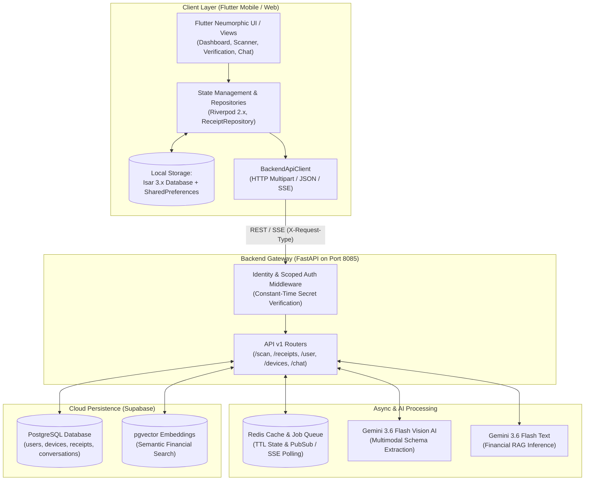
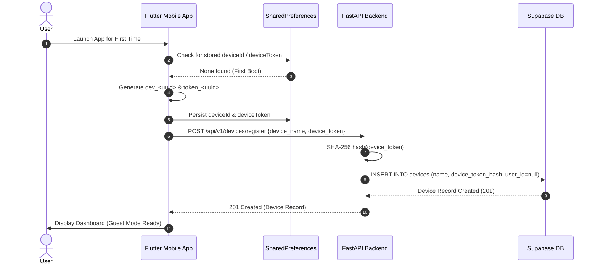
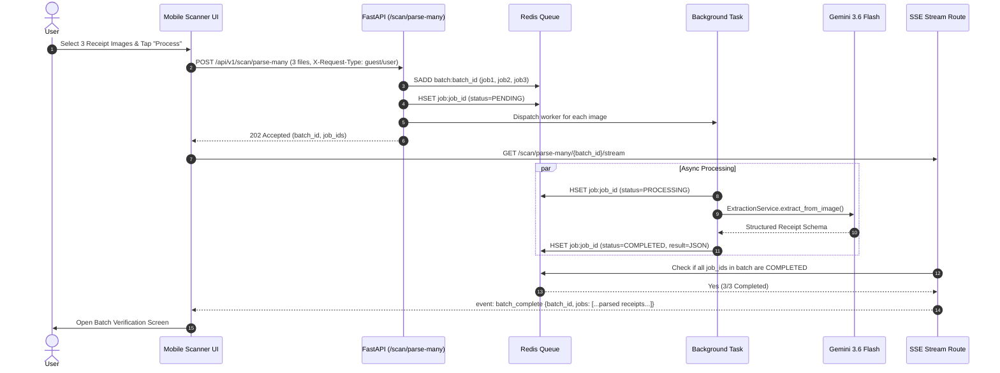
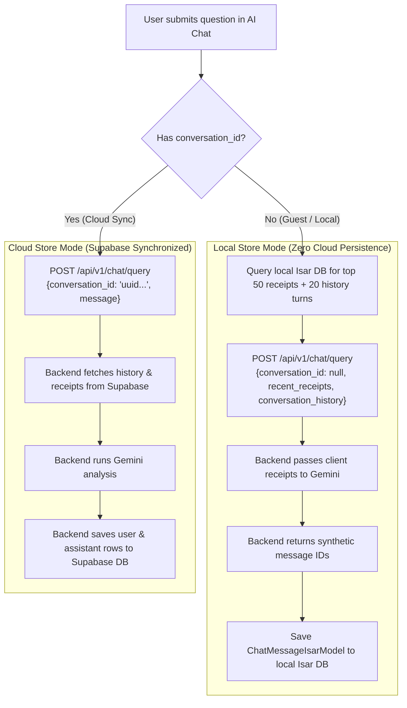
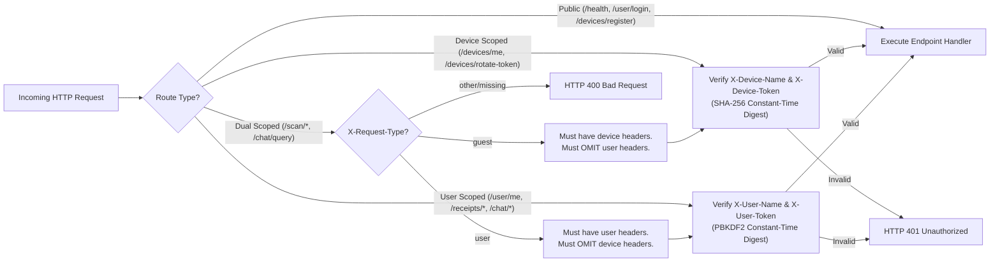

# Receipt Logger — Data Flow & User Interaction Workflows

This document details how data flows across all layers of the Receipt Logger ecosystem—from user touchpoints on Flutter mobile/web clients down to the local Isar database, FastAPI backend, Redis job queue, Google Gemini 3.6 Flash Vision AI, and Supabase cloud persistence.

---

## 1. System Architecture & High-Level Topology

---

## 2. Core User Workflows & Data Flows

### Workflow 1: First Boot & Guest Mode Initialization
When a user launches the app for the first time without an account:

1. **Hardware Identity Generation**:
   - `DeviceIdentityService` generates a persistent UUID `deviceId` (e.g. `dev_a1b2c3d4...`) and a cryptographic random `deviceToken` (e.g. `token_e5f6a7b8...`).
   - These credentials are saved to local `SharedPreferences`.
2. **Device Registration with Backend**:
   - Client sends `POST /api/v1/devices/register` with `{"device_name": deviceId, "device_token": deviceToken}`.
   - Backend hashes the `device_token` with SHA-256 and stores the record in Supabase's `devices` table with `user_id = null`.
3. **Local Store Operation**:
   - All subsequent scans, categories, and spending transactions save immediately to local **Isar 3.x database**.
   - Guest requests to the backend (`/scan/*`, `/chat/query`) use `X-Request-Type: guest`, sending `X-Device-Name` and `X-Device-Token`.

---

### Workflow 2: Receipt Scanning & Structured AI Extraction

Users can scan receipts using two primary modes:

#### Mode A: Single Receipt Instant Scan
1. User taps the Camera Scanner CTA, snaps a photo, or selects an image from gallery.
2. Flutter reads image bytes and calls `BackendApiClient.parseReceiptImage()` (`POST /api/v1/scan/parse`).
3. Backend validates file size (max 10MB) and invokes Google Gemini 3.6 Flash Multimodal Vision (`ExtractionService`).
4. Gemini extracts structured fields (`merchant_name`, `line_items`, `tax_amount`, `total_amount`, `currency`, `category`, `confidence_score`, `raw_text`).
5. Backend verifies document validation score (`confidence_score >= 0.80`).
6. Backend returns `200 OK` with the parsed `Receipt` DTO.
7. Mobile client automatically pushes to `/verification` route, displaying pre-populated editable fields for user confirmation.

#### Mode B: Bulk Multi-Receipt Async Scan
1. User selects 2 to 10 receipts from gallery or camera batch mode.
2. Client sends `POST /api/v1/scan/parse-many` with the image files array.
3. Backend verifies batch bounds (2-10 files), registers a `batch_id` in Redis, schedules `process_receipt_worker` background tasks for each image, and returns `202 Accepted` with `batch_id`.
4. Client opens an SSE connection to `GET /api/v1/scan/parse-many/{batch_id}/stream`.
5. Background workers invoke Gemini in parallel and write completion states (`COMPLETED`/`FAILED`) and JSON results into Redis hashes.
6. When all tasks reach a terminal state, backend SSE stream emits `event: batch_complete` with the full array of extracted receipts.
7. Client UI closes the loader modal and presents the batch review deck.

---

### Workflow 3: Verification, Editing & Local Isar Persistence
1. User reviews the extracted merchant name, itemized line items, totals, date, and category.
2. User can tap any field to correct OCR mistakes or add custom line items.
3. Upon tapping "Confirm & Save":
   - Flutter creates an `ReceiptIsarModel` object.
   - Transaction is written atomically to local **Isar DB** (`ReceiptRepository.saveReceipt()`).
   - If user is logged in, a sync event is queued for remote cloud sync.
4. Dashboard and History tabs immediately update reactively via Riverpod state streams.

---

### Workflow 4: Financial AI Assistant & Spending Chat
The AI chat system supports dual storage architectures based on privacy preference and authentication status:

#### A. Local Store Mode (Guest or Offline User)
- User asks a financial question in `/ai-assistant` (e.g. *"How much did I spend on groceries this week?"*).
- Flutter queries local Isar DB for the top 50 recent receipts and gathers the last 20 chat turns.
- Client calls `POST /api/v1/chat/query` with `conversation_id = null`, sending `recent_receipts` and `conversation_history` in the request body.
- Backend passes these receipts as RAG context to Gemini 3.6 Flash.
- **Zero data is written to Supabase**.
- Backend returns synthetic UUIDs for user and assistant messages, which Flutter saves directly into local Isar DB (`ChatMessageIsarModel`).

#### B. Cloud Store Mode (Authenticated User)
- User selects an existing conversation or creates a new one (`POST /api/v1/chat/create`).
- Client calls `POST /api/v1/chat/query` with `conversation_id = <uuid>`.
- Backend fetches conversation history from Supabase, injects user's cloud receipts into Gemini context, and generates the analysis.
- Backend atomically inserts both user and assistant messages into Supabase's `chat_messages` table.

---

### Workflow 5: Account Linking & Guest Data Cloud Migration
When a guest user decides to create an account or sign in:

1. **User Sign In**: User submits credentials via `POST /api/v1/user/login`.
2. **Local Data Export**: `DataExportService.exportGuestData()` serializes all local Isar receipts, conversations, and chat messages into a JSON migration package.
3. **Hardware & Data Linking**:
   - Client calls `POST /api/v1/devices/link` with:
     - Headers: `X-Device-Name`, `X-Device-Token`, `X-User-Name`, `X-User-Token`
     - Body: `{"device_name": deviceId, "username": username, "migrate_data": { receipts, conversations, chat_messages }}`
4. **Cloud Migration Engine**:
   - `DataMigrationService` runs a Supabase batch transaction:
     - Associates `device_id` with `user_id`.
     - Inserts all guest receipts into `receipts` table associated with `user_id`.
     - Inserts conversations and chat messages into Supabase.
5. **Local State Sync**:
   - Local Isar models are updated with cloud IDs and `is_synced = true`.

---

## 3. End-to-End Security & Header Validation Rules

---

## 4. Summary Table of App Capabilities

| Feature Area | Client Technologies | Backend Services | Storage Strategy |
| :--- | :--- | :--- | :--- |
| **Receipt Scanning** | Camera, ImagePicker, ML Kit | FastAPI `/scan/parse`, Gemini 3.6 Flash Vision | In-memory stream, Redis async jobs |
| **Local Persistence** | Isar 3.x Database | None (Client-side) | On-device encrypted SQLite/Isar binary |
| **Cloud Synchronization** | Riverpod Sync Notifier, `BackendApiClient` | FastAPI `/receipts`, Supabase PostgreSQL | Delta timestamps (`updated_after`), batch inserts |
| **Financial AI Chat** | Markdown Renderer, Neumorphic Chat UI | FastAPI `/chat/query`, Gemini 3.6 Flash | Dual-Store (Isar for local, Supabase for cloud) |
| **Device Security** | `DeviceIdentityService`, `SharedPreferences` | `src/Auth/` constant-time digest verification | Hardware token hash in `devices` table |
